# bigdata_tmp


# 工厂


# 利用unapply模式提取


# case class 自动封装apply

# option


# zeppelin导入外部依赖

　一、我们都知道，很多类库都是可以通过Maven仓库下载到的，所以我们可以指定依赖库的group ID、artifact ID以及version来指定具体的依赖。在Zeppelin中，我们可以通过%dep Interpreter来加载依赖，如下：

```
%dep
z.load("mysql:mysql-connector-java:5.1.35")
```

%dep默认就可以使用，z代表的是Zeppelin context。

如果我们觉得Maven中央仓库下载的速度比较慢，我们可以自定义Maven仓库，如下：

```
%dep
z.addRepo("RepoName").url("RepoURL")
```

　　二、通过指定jar的本地路径来加载外部依赖，具体如下：

```
%dep
z.load("/path/to.jar")
```

如果需要导入自己的 jar 包:

- 点击 File -> Project Structure -> Project Settings -> Libraries
  
  
- 点击左上加号选择 java

- 选择 jar 包所在目录

- 点击 ok 完成设置

  # 持久化

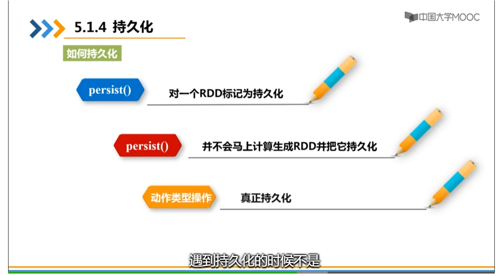

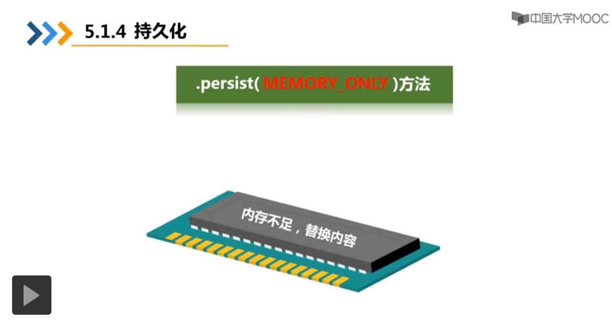

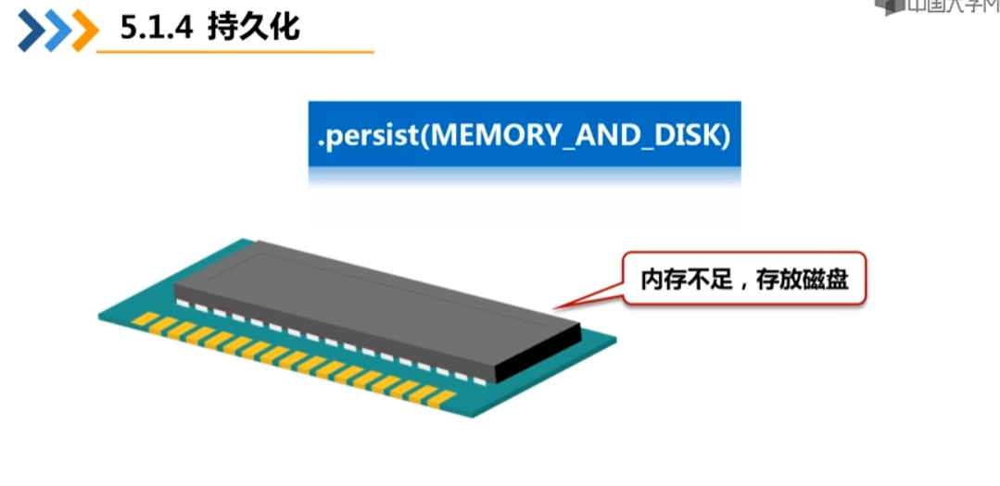

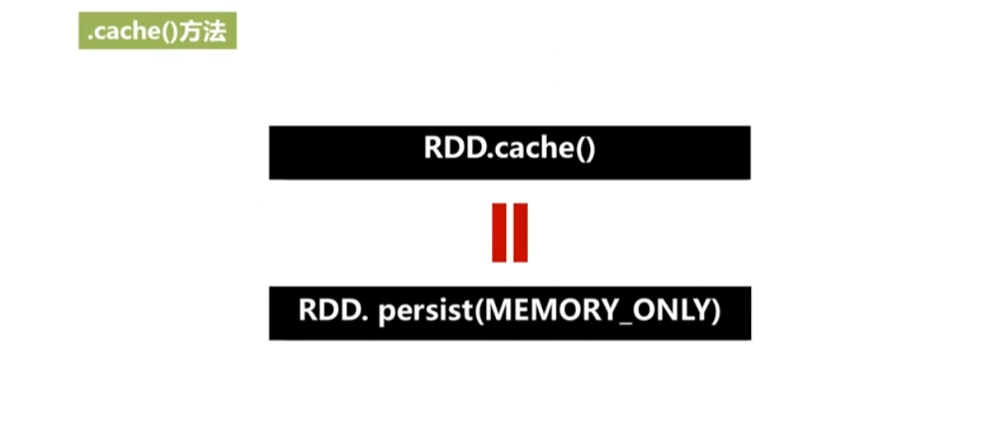

# 自定义分区

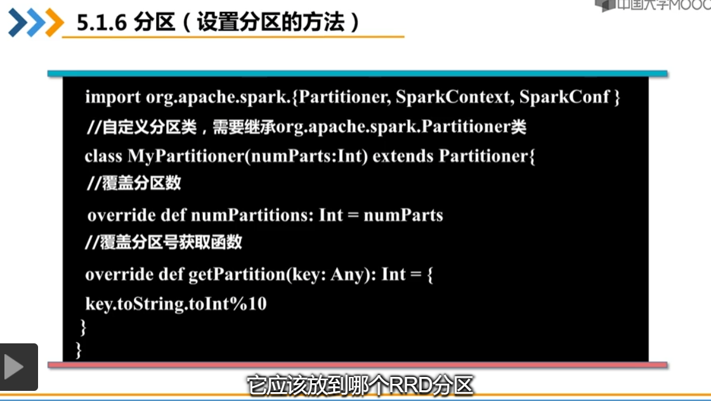

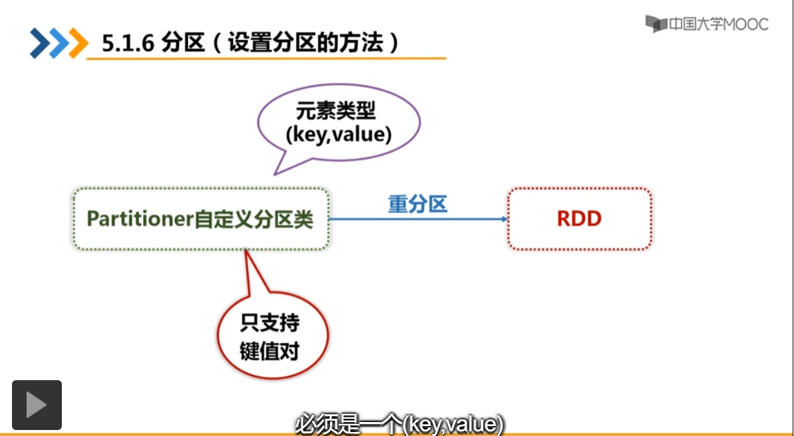

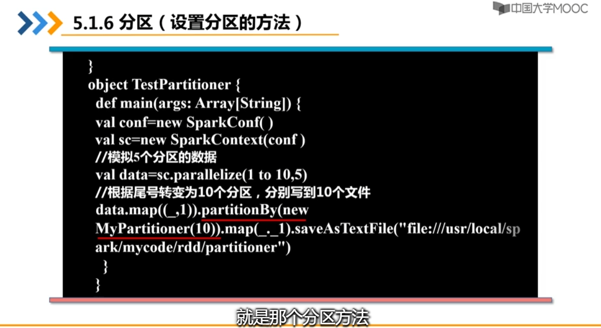

# 中文wordcount

```xml
<dependency>
        <groupId>com.huaban</groupId>
        <artifactId>jieba-analysis</artifactId>
        <version>1.0.2</version>
    </dependency>
```

```scala
import com.huaban.analysis.jieba.JiebaSegmenter
import org.apache.spark.{SparkConf, SparkContext}
object WordSp {
  def main(args: Array[String]): Unit = {
    val conf = new SparkConf().setAppName("input").setMaster("local[*]")
    val sc = new SparkContext(conf)
    val rdd=sc.textFile("file")
      .map { x =>
        var str = if (x.length > 0)
          new JiebaSegmenter().sentenceProcess(x)
        str.toString
      }.top(50).foreach(println)
  }
}
```

# Map写入无元素的问题

而在以下代码中，Map不能添加元素

```scala
val no2ID = scala.collection.mutable.Map[Int,String]()
sc.textFile(conf).foreach(line=>{
val splits = line.split(“,”)
val no = splits(0).trim.toInt
val ID = splits(1)
no2ID += (no -> ID)
})
其中conf文件为数字和对应的人名
```


把RDD使用collect转化成Array后，可以向Map添加元素

```scala
val no2ID = scala.collection.mutable.Map[Int,String]()
sc.textFile(conf).collect().foreach(line=>{
val splits = line.split(“,”)
val no = splits(0).trim.toInt
val ID = splits(1)
no2ID += (no -> ID)
})
```

# 常见算子（惰性机制，action才触发）

spark就设定了惰性机制（lazy特性），当没有出现action操作的时候，所有RDD转换操作不会执行，程序会为其生成DAG，直到遇到action才触发

## transformation算子

transformation操作主要是对每个RDD中的元素进行处理并生成新的RDD

- map
- flatMap
- filter
- groupByKey
- reduceByKey
- sortByKey

## action算子

action则主要是对RDD进行最后的操作，比如遍历、reduce、保存到文件等（虽然最终可能还是保存到一个新的RDD上，但至少从设计上是具备输出能力的），并可以返回结果给Driver程序。

- reduce
- collect
- first
- take
- aggregate
- countByKey
- foreach
- saveAsTextFile

# RDD转DataFrame

## 利用反射推断RDD的模式得到DataFrame

一个类属于一个样例类case class时候才能被spark隐式的转换为DataFrame

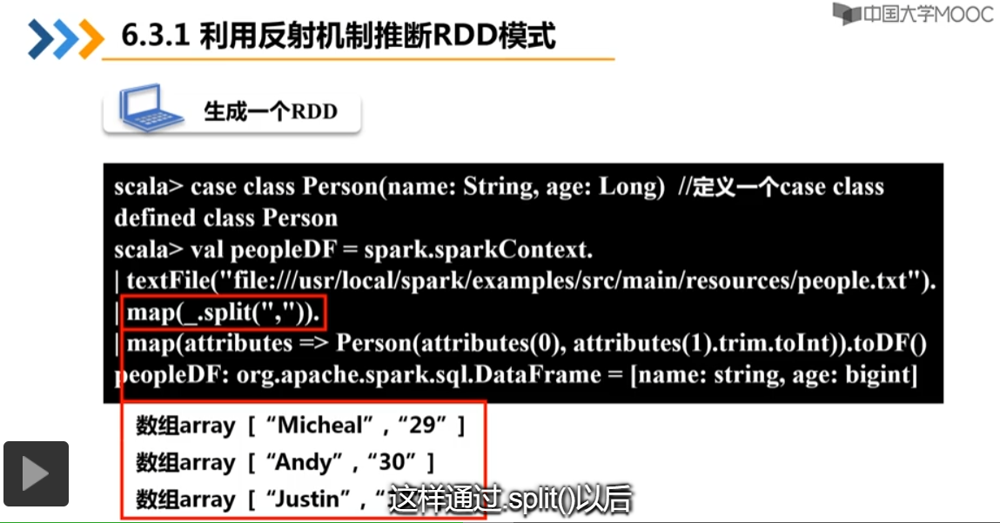

## 使用编程的方式动态的定义RDD模式

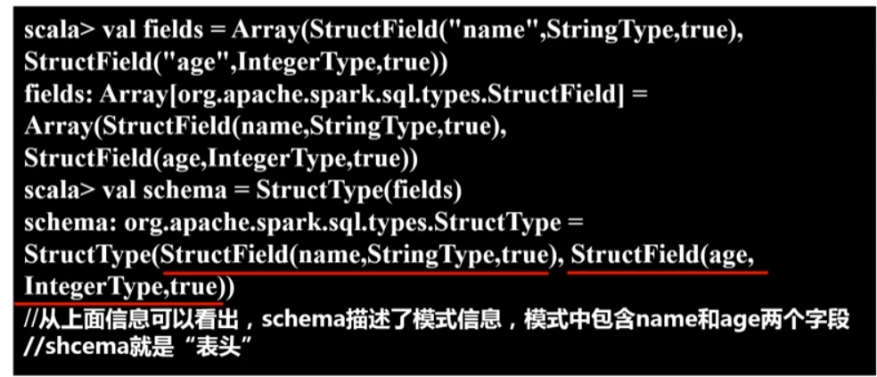

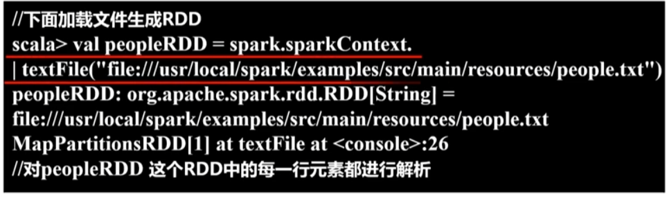

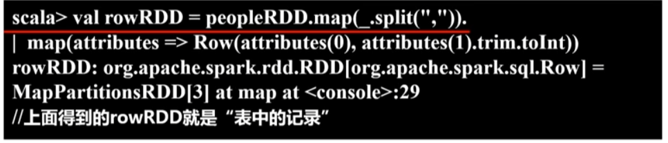

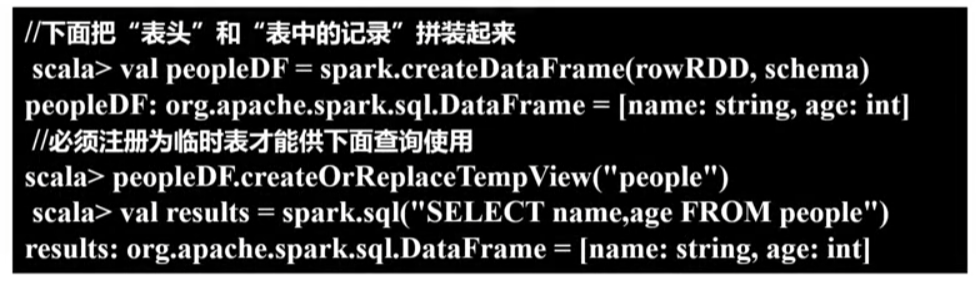