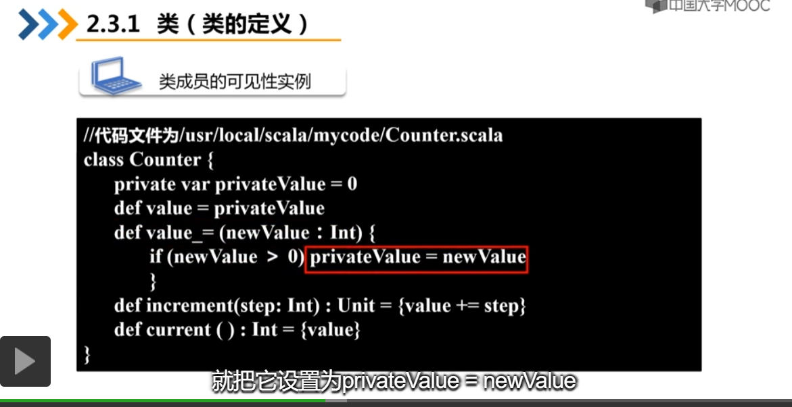

# bigdata_tmp





# 工厂


# 利用unapply模式提取


# case class 自动封装apply

# option


# zeppelin导入外部依赖

　一、我们都知道，很多类库都是可以通过Maven仓库下载到的，所以我们可以指定依赖库的group ID、artifact ID以及version来指定具体的依赖。在Zeppelin中，我们可以通过%dep Interpreter来加载依赖，如下：

```
%``dep``z.load(``"mysql:mysql-connector-java:5.1.35"``)
```

%dep默认就可以使用，z代表的是Zeppelin context。

如果我们觉得Maven中央仓库下载的速度比较慢，我们可以自定义Maven仓库，如下：

```
%dep
z.addRepo("RepoName").url("RepoURL")
```

　　二、通过指定jar的本地路径来加载外部依赖，具体如下：

```
%dep
z.load("/path/to.jar")
```

如果需要导入自己的 jar 包:

- 点击 File -> Project Structure -> Project Settings -> Libraries
  
- 点击左上加号选择 java
- 选择 jar 包所在目录
- 点击 ok 完成设置